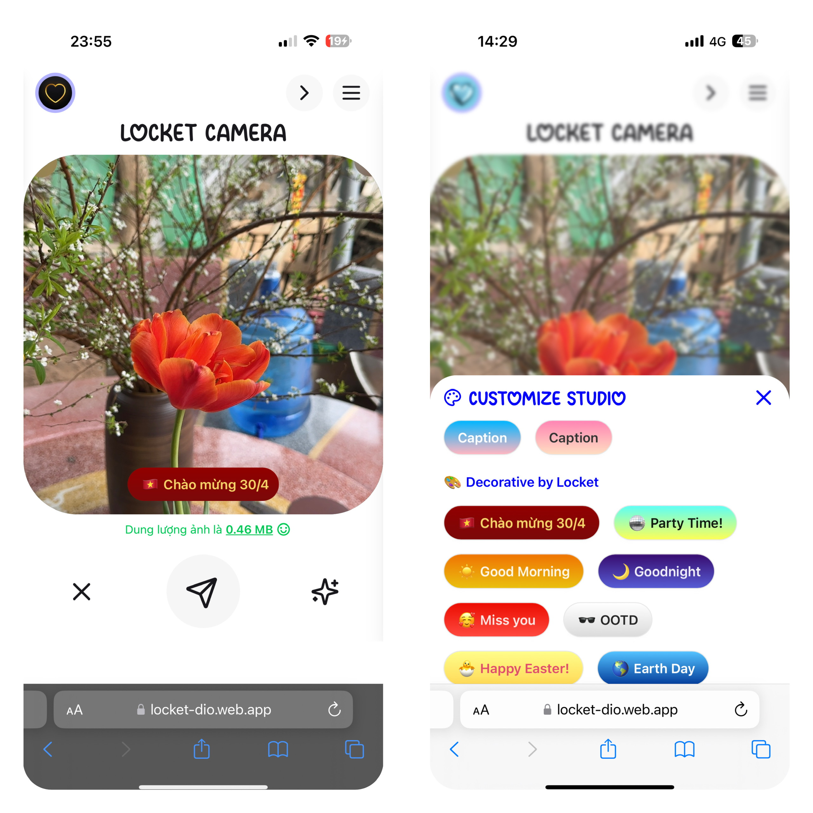

# 📸 Locket Dio

<div align="center">

<p align="center">
  
</p>

**Ứng dụng web hiện đại dành cho cộng đồng Locket Widget - Chia sẻ ảnh và video ngay lập tức từ trình duyệt**

[](https://github.com/doi2523/Client-Locket-Dio/releases)
[](https://opensource.org/licenses/MIT)
[](https://locket-dio.com)
[](http://makeapullrequest.com)

[](https://reactjs.org/)
[](https://vitejs.dev/)
[](https://developer.mozilla.org/docs/Web/JavaScript)
[](https://tailwindcss.com/)

[**🌐 Demo Trực Tiếp**](https://locket-dio.com) | [**📱 Repo Frontend**](https://github.com/doi2523/Client-Locket-Dio) | [**💬 Telegram**](https://t.me/ddevdio) | [**📖 Tài Liệu**](#-tài-liệu)

</div>

---

## 📋 Mục Lục

- [✨ Tính Năng](#-tính-năng)
- [🚀 Demo](#-demo)
- [🛠️ Cài Đặt](#️-cài-đặt)
- [⚙️ Cấu Hình](#️-cấu-hình)
- [🏗️ Công Nghệ](#️-công-nghệ)
- [📁 Cấu Trúc Dự Án](#-cấu-trúc-dự-án-tham-khảo)
- [🔧 Tham Khảo API](#-tham-khảo-api)
- [🤝 Đóng Góp](#-đóng-góp)
- [📜 Giấy Phép](#-giấy-phép)
- [👥 Tác Giả](#-tác-giả)
- [🙏 Lời Cảm Ơn](#-lời-cảm-ơn)
- [📞 Hỗ Trợ](#-hỗ-trợ)

---

## ✨ Tính Năng

### 🔐 Xác Thực & Bảo Mật
- **🚀 Đăng Nhập Nhanh** - Hệ thống xác thực đơn giản và an toàn
- **🔒 Bảo Mật Dữ Liệu** - Không lưu trữ dữ liệu người dùng, ưu tiên quyền riêng tư
- **🛡️ Phiên Bảo Mật** - Xác thực dựa trên JWT token
- **🔐 Bảo Vệ Route** - Bảo mật cấp độ đường dẫn

### 📸 Camera & Quay Chụp
- **📷 Truy Cập Camera Trực Tiếp** - Chụp ảnh ngay trong trình duyệt
- **🎥 Quay Video HD** - Quay video chất lượng cao
- **🔄 Chuyển Đổi Camera** - Hỗ trợ camera trước/sau trên di động
- **⚡ Xem Trước Thời Gian Thực** - Live camera feed với điều khiển

### 🖼️ Quản Lý Media
- **📂 Tải File Lên** - Upload từ thư viện thiết bị
- **👁️ Xem Trước Media** - Xem trước nội dung trước khi chia sẻ
- **✂️ Cắt Thông Minh** - Cắt vuông với lựa chọn tùy chỉnh
- **📝 Caption Tùy Chỉnh** - Thêm tin nhắn cá nhân hóa
- **❤️ Tương Tác** - Hệ thống thả cảm xúc tương tác

### 🎨 Trải Nghiệm Người Dùng
- **📱 Thiết Kế Responsive** - Hoạt động trên mọi thiết bị và kích thước màn hình
- **🌙 Giao Diện Hiện Đại** - Interface sạch sẽ, trực quan
- **⚡ Hiệu Suất Nhanh** - Được tối ưu hóa với Vite bundler
- **🔮 Animation Mượt Mà** - Được hỗ trợ bởi Framer Motion
- **📊 Lịch Sử Moment** - Xem lại các khoảnh khắc đã chia sẻ

### 🔔 Tính Năng Nâng Cao
- **🔔 Thông Báo Đẩy** - Thông báo thời gian thực qua Firebase
- **💾 Hỗ Trợ Offline** - IndexedDB cho chức năng offline
- **🌐 PWA Sẵn Sàng** - Khả năng Progressive Web App
- **☁️ Lưu Trữ Đám Mây** - Tích hợp Cloudinary cho media
- **🎯 Theo Dõi Hiệu Suất** - Analytics tích hợp sẵn

---

## 🚀 Demo

<div align="center">

[](https://locket-dio.com)

</div>

### 📱 Ảnh Chụp Màn Hình

<details>
<summary><strong>🖼️ Xem Ảnh Giao Diện</strong></summary>

<div align="center">
  
  
  
</div>

</details>

---

## 🛠️ Cài Đặt

### 📋 Yêu Cầu Hệ Thống

Trước khi bắt đầu, hãy đảm bảo bạn đã cài đặt:

- **Node.js** >= 18.0.0
- **npm** >= 8.0.0 hoặc **yarn** >= 1.22.0
- **Git** để quản lý phiên bản

### ⬇️ Clone Repository

```bash
git clone https://github.com/doi2523/Client-Locket-Dio.git
cd Client-Locket-Dio
```

### 📦 Cài Đặt Dependencies

Sử dụng npm:
```bash
npm install
```

Sử dụng yarn:
```bash
yarn install
```

### 🏃‍♂️ Chạy Development Server

```bash
npm run dev
# hoặc
yarn dev
```

Mở [http://localhost:5173](http://localhost:5173) để xem trong trình duyệt.

### 🏗️ Build cho Production

```bash
npm run build
# hoặc
yarn build
```

### 👀 Xem Trước Production Build

```bash
npm run preview
# hoặc
yarn preview
```

---

## ⚙️ Cấu Hình

### 🔧 Biến Môi Trường

Tạo file `.env` trong thư mục gốc:

```env
# =========================
# 🌐 Cấu Hình API
# =========================

# API chính cho logic, moments, users
VITE_BASE_API_URL=https://apilocket-diov2.onrender.com

# API test cơ sở dữ liệu
VITE_BASE_API_URL_DB=http://localhost:3001

# API thanh toán (PayOS hoặc cổng tùy chỉnh)
VITE_PAYMENT_API_URL=http://localhost:5005

# =========================
# ☁️ Cấu Hình Cloudinary
# =========================

# Tên Cloudinary cloud để tải media lên
VITE_CLOUDINARY_CLOUD_NAME=your_cloud_name_here

# =========================
# 🔔 Thông Báo Đẩy
# =========================

# VAPID public key cho web push notifications
VITE_VAPID_PUBLIC_KEY=your_vapid_public_key_here

# =========================
# 🔥 Cấu Hình Firebase
# =========================

# Firebase API key
VITE_FIREBASE_API_KEY=your_firebase_api_key_here

# Auth domain (định dạng: your-app.firebaseapp.com)
VITE_FIREBASE_AUTH_DOMAIN=your_firebase_auth_domain_here

# Firebase project ID
VITE_FIREBASE_PROJECT_ID=your_firebase_project_id_here

# Storage bucket cho files, hình ảnh, video
VITE_FIREBASE_STORAGE_BUCKET=your_firebase_storage_bucket_here

# Messaging sender ID cho push notifications
VITE_FIREBASE_MESSAGING_SENDER_ID=your_firebase_messaging_sender_id_here

# Firebase app ID
VITE_FIREBASE_APP_ID=your_firebase_app_id_here

# Measurement ID cho Google Analytics
VITE_FIREBASE_MEASUREMENT_ID=your_firebase_measurement_id_here
```

### 🔑 Lấy API Keys

<details>
<summary><strong>Thiết Lập Firebase</strong></summary>

1. Truy cập [Firebase Console](https://console.firebase.google.com/)
2. Tạo project mới hoặc chọn project hiện có
3. Điều hướng đến Project Settings > General
4. Copy các giá trị cấu hình vào file `.env` của bạn

</details>

<details>
<summary><strong>Thiết Lập Cloudinary</strong></summary>

1. Đăng ký tại [Cloudinary](https://cloudinary.com/)
2. Truy cập Dashboard
3. Copy Cloud Name của bạn vào `VITE_CLOUDINARY_CLOUD_NAME`

</details>

---

## 🏗️ Công Nghệ

<div align="center">

| Frontend | Backend Services | Development |
|----------|------------------|-------------|
| [](https://reactjs.org/) | [](https://firebase.google.com/) | [](https://vitejs.dev/) |
| [](https://developer.mozilla.org/en-US/docs/Web/JavaScript) | [](https://cloudinary.com/) | [](https://eslint.org/) |
| [](https://tailwindcss.com/) | [](https://axios-http.com/) | [](https://prettier.io/) |
| [](https://www.framer.com/motion/) | [](https://jwt.io/) | |

</div>

---

## 📁 Cấu Trúc Dự Án Tham Khảo

```
Client-Locket-Dio/
├── 📂 public/                      # Tài nguyên tĩnh, truy cập trực tiếp
│   ├── 📁 images/                  # Ảnh minh họa, biểu tượng
│   ├── 📄 favicon.ico             # Icon website
│   ├── 📄 manifest.json           # Thông tin PWA (Progressive Web App)
│   └── 📄 robots.txt              # Quy tắc crawl cho bot tìm kiếm
│
├── 📂 src/                         # Mã nguồn chính
│   ├── 📁 assets/                 # Ảnh, font, video dùng trong code
│   ├── 📁 components/             # Các thành phần UI tái sử dụng
│   │   ├── 📁 common/            # Các UI nhỏ như Button, Modal, Icon
│   │   ├── 📁 camera/            # Component Camera, Recorder
│   │   ├── 📁 media/             # Preview, Editor, Upload
│   │   └── 📁 auth/              # Đăng nhập, đăng ký, xác thực
│   │
│   ├── 📁 context/                # React Context: Auth, Theme, AppState...
│   ├── 📁 cache/                  # Setting cache với indexDB...
│   ├── 📁 config/                 # Cài đặt kết nối...
│   ├── 📁 hooks/                  # Custom hooks: useAuth, useTheme...
│   ├── 📁 layout/                 # MainLayout, LocketLayout...
│   ├── 📁 pages/                  # Các trang chính: Home, Login, Moment...
│   ├── 📁 routes/                 # Định tuyến React Router
│   ├── 📁 services/               # Gọi API (axios/fetch)
│   ├── 📁 lib/                    # Cấu trúc axios, fetch...
│   ├── 📁 utils/                  # Hàm tiện ích: formatDate, validate...
│   ├── 📁 constants/              # Biến cấu hình, enums, routes...
│   ├── 📁 styles/                 # CSS/tailwind bổ sung (nếu cần)
│   │   └── global.css
│   │
│   ├── ⚙️ App.jsx                 # App chính, chứa Router & Layout
│   ├── ⚙️ main.jsx                # Entry Point chính
│   ├── ⚙️ sw.jsx                  # Service Worker (PWA, push...)
│   └── 📄 index.css               # CSS toàn cục (import Tailwind)
│
├── 📄 .env                        # Biến môi trường thực tế (không commit)
├── 📄 .env.example                # Biến môi trường mẫu
├── 📄 .gitignore                  # Bỏ qua file khi push Git
├── 📄 README.md                  # Mô tả dự án
│
├── 📦 package.json               # Danh sách thư viện và script
├── 📦 package-lock.json          # Khóa phiên bản chính xác
│
├── ⚙️ vite.config.js              # Cấu hình Vite và PWA
├── 🎨 tailwind.config.js          # Cấu hình Tailwind CSS
├── 🔥 firebase.json               # Cấu hình Firebase (hosting, rewrites)
```

---

## 📚 Dependencies Chính

| Package | Phiên Bản | Mô Tả |
|---------|-----------|-------|
| **Frontend Framework** |
| `react` | ^18.2.0 | Thư viện React để xây dựng UI |
| `react-dom` | ^18.2.0 | React DOM renderer |
| `react-router-dom` | ^7.2.0 | Client-side routing |
| **Styling & Animation** |
| `@tailwindcss/vite` | ^4.0.9 | Tailwind CSS cho styling |
| `lucide-react` | ^0.476.0 | Thư viện icon đẹp |
| **Backend Integration** |
| `firebase` | ^11.9.0 | Firebase SDK cho backend services |
| `axios` | ^1.8.1 | HTTP client cho API calls |
| `jwt-decode` | ^4.0.0 | JWT token decoder |
| **Media & Storage** |
| `dexie` | ^4.0.11 | IndexedDB wrapper cho offline storage |
| `react-easy-crop` | ^5.4.2 | Component cắt hình ảnh |
| **UI/UX Enhancement** |
| `react-toastify` | ^11.0.5 | Hệ thống toast notification |

---

## 🔧 Tham Khảo API

### 🔐 Xác Thực

```http
POST /locket/login
Content-Type: application/json

{
  "username": "string",
  "password": "string"
}
```

### 📸 Tải Media Lên

```http
POST /locket/postMomentV2
Authorization: Bearer {token}
Content-Type: application/json

{
  "model": "Version-UploadmediaV3.1",
  "mediaInfo": {
    "url": "https://cdn.example.com/path/to/file.jpg",
    "path": "user_uploads/abc123.jpg",
    "name": "abc123.jpg",
    "size": 194203,
    "contentType": "image/jpeg",
    "timeCreated": "2025-07-24T14:30:00Z",
    "type": "image"
  },
  "options": {
    "caption": "Caption tuỳ chọn",
    "overlay_id": "abc123",
    "type": "caption_theme",
    "icon": "❤️",
    "text_color": "#FFFFFF",
    "color_top": "#000000",
    "color_bottom": "#FF0000",
    "audience": "selected",
    "recipients": ["uid1", "uid2"],
    "music": "https://cdn.example.com/music.mp3"
  }
}
```

---

## 🤝 Đóng Góp

Chúng tôi yêu thích những đóng góp! Vui lòng đọc [Hướng Dẫn Đóng Góp](CONTRIBUTING.md) để tìm hiểu về quy trình phát triển, cách đề xuất sửa lỗi và cải tiến.

### 🚀 Bắt Đầu Nhanh cho Contributors

1. **Fork** repository này
2. **Clone** fork của bạn: `git clone https://github.com/doi2523/Client-Locket-Dio.git`
3. **Cài đặt** dependencies: `npm install`
4. **Tạo** branch: `git checkout -b feature/new-feature-babi`
5. **Thực hiện** thay đổi của bạn
6. **Test** thay đổi: `npm run test`
7. **Commit** thay đổi: `git commit -m 'Thêm tính năng tuyệt vời'`
8. **Push** lên branch: `git push origin feature/tinh-nang-tuyet-voi`
9. **Mở** Pull Request

### 📋 Hướng Dẫn Phát Triển

- Tuân theo style code hiện có
- Viết commit message rõ ràng
- Thêm test cho tính năng mới
- Cập nhật tài liệu khi cần
- Đảm bảo tất cả test pass trước khi submit PR

### 🐛 Báo Cáo Lỗi

Khi báo cáo lỗi, vui lòng bao gồm:

- **Mô tả** vấn đề
- **Các bước tái hiện** vấn đề
- **Hành vi mong đợi**
- **Screenshots** (nếu có)
- **Chi tiết môi trường** (OS, trình duyệt, phiên bản)

---

## 🗺️ Lộ Trình

- [ ] 🎨 **Chỉnh Sửa Hình Ảnh Nâng Cao** - Bộ lọc và hiệu ứng cho ảnh/video
- [ ] 🌙 **Hệ Thống Theme** - Chế độ Dark/Light với nhiều theme
- [ ] 🔔 **Thông Báo Nâng Cao** - Hệ thống push notification tiên tiến
- [ ] 📱 **Progressive Web App** - Triển khai PWA đầy đủ
- [ ] 🔍 **Tìm Kiếm & Khám Phá** - Tìm và khám phá moments
- [ ] 👥 **Tính Năng Xã Hội** - Bạn bè, nhóm và chia sẻ

---

## 📊 Thống Kê Dự Án

<div align="center">


</div>

---

## 📜 Giấy Phép

Dự án này được cấp phép theo Giấy phép MIT - xem file [LICENSE](LICENSE) để biết chi tiết.

```
Giấy Phép MIT

Bản quyền (c) 2025 Locket Dio

Được cấp phép miễn phí cho bất kỳ ai có được bản sao
của phần mềm này và các file tài liệu liên quan (gọi là "Phần mềm"), để xử lý
Phần mềm mà không bị hạn chế, bao gồm không giới hạn các quyền
sử dụng, sao chép, sửa đổi, hợp nhất, xuất bản, phân phối, cấp phép con và/hoặc bán
các bản sao của Phần mềm, và cho phép những người được cung cấp
Phần mềm làm như vậy, với điều kiện sau:

Thông báo bản quyền này và thông báo cho phép này phải được bao gồm trong tất cả
các bản sao hoặc phần quan trọng của Phần mềm.
```

---

## 👥 Tác Giả

<div align="center">

**🚀 Được tạo với ❤️ bởi**

[](https://github.com/doi2523)

<a href="https://github.com/doi2523">
  
</a>

**[Dio (@doi2523)](https://github.com/doi2523)**  
*Full Stack Developer*

</div>

---

## 🙏 Lời Cảm Ơn

- 🎨 **Cảm Hứng Thiết Kế** - Xu hướng thiết kế web hiện đại và mẫu trải nghiệm người dùng
- 📚 **Cộng Đồng Open Source** - Cho những thư viện và công cụ tuyệt vời
- 🔥 **Đội Ngũ Firebase** - Vì đã cung cấp dịch vụ backend xuất sắc
- ☁️ **Cloudinary** - Cho giải pháp quản lý media đáng tin cậy
- 💡 **Cộng Đồng Locket Widget** - Vì cảm hứng và phản hồi
- 🌟 **Contributors** - Mọi người đã đóng góp cho dự án này

---

## 📞 Hỗ Trợ

<div align="center">

### 💬 Nhận Trợ Giúp

[](https://github.com/doi2523/Client-Locket-Dio/issues)
[](https://github.com/doi2523/Client-Locket-Dio/discussions)
[](https://t.me/ddevdio)

### ☕ Ủng Hộ Dự Án

[](https://www.buymeacoffee.com/dio)
[](https://locket-dio.com/donate)

</div>

### 📧 Thông Tin Liên Hệ

- **Email**: doibncm2003@gmail.com
- **Website**: [https://locket-dio.com](https://locket-dio.com)
- **Telegram**: [@ddevdio](https://t.me/ddevdio)
- **GitHub**: [@doi2523](https://github.com/doi2523)

---

## ⚠️ Lưu Ý Quan Trọng

> 🔒 **Ưu Tiên Quyền Riêng Tư**: Ứng dụng này tuân theo phương pháp ưu tiên quyền riêng tư. Chúng tôi không lưu trữ dữ liệu người dùng không cần thiết.

> 🔧 **Trạng Thái Backend**: Dịch vụ backend hiện đang ở chế độ riêng tư và chứa các thành phần nội bộ chưa sẵn sàng để phát hành công khai.

> 🌟 **Phát Triển Tích Cực**: Dự án này được duy trì và cập nhật thường xuyên.

---

<div align="center">

### ⭐ Hãy Star repository này nếu bạn thấy hữu ích!

**Được tạo với ❤️ bởi [Dio](https://github.com/doi2523) | © 2025 [Locket Dio](https://locket-dio.com) | Tất cả quyền được bảo lưu**

[](#-locket-dio)

</div>
